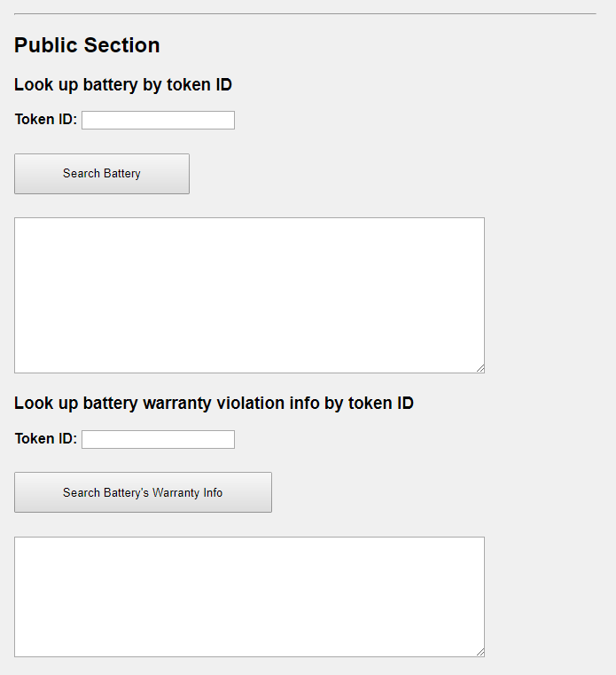

# Blockchain-based Decentralized Smart Warranty Application 

## Project overview

In this project, the smart contracts and DApp of decentralized smart warranty application has been created for energy storage supply chain and its warranty management.
The smart contract is to be deployed on the public testnet Rinkeby. 
The blockchain identity to secure digital assets is managed on the Ethereum platform using a smart contract using Solidity.

## Installing and Testing

Clone this repository:

```
git clone https://github.com/kiyoasis/blockchain_smart_warranty_application.git
```

Change directory to ```smart_contracts``` folder and install all requisite npm packages as

```
cd smart_contracts
npm install
```

Launch Ganache:

```
ganache-cli -m "spirit supply whale amount human item harsh scare congress discover talent hamster"
```

Your terminal should look something like this:


In a separate terminal window, Compile smart contracts:

```
truffle compile
```

This will create the smart contract artifacts in folder ```build\contracts```.

Migrate smart contracts to the locally running blockchain, ganache-cli:

```
truffle migrate
```

Test smart contracts:

```
truffle test
```

All 9 tests should pass.


Also, install truffle ABI export from npm as
``` npm install -g truffle-export-abi ```

Then, run it in the truffle project
``` truffle-export-abi ```.
You will see, ABI extracted and output file wrote to: build/ABI.json, so that you can check the ABI there.

## Deploy smart contract on Public Test Network (Rinkeby)
Deploy the contracts in the Rinkeby network as
```
truffle migrate —-network rinkeby
```

Using network 'rinkeby'.

Running migration: 1_initial_migration.js
  
  Deploying Migrations...

  ... 0x1d659Ed78252399eE98622644478049d76a0275f

  ...

## Steps and Record of Transactions

### contract address
0x1d659Ed78252399eE98622644478049d76a0275f

https://rinkeby.etherscan.io/address/0x1d659ed78252399ee98622644478049d76a0275f


### contract hash
0xbe3e34e9a5cfe64dcbe1ceb72565eaccb24c5e8111dd138228278ba790206f9b

https://rinkeby.etherscan.io/tx/0xbe3e34e9a5cfe64dcbe1ceb72565eaccb24c5e8111dd138228278ba790206f9b

### produceBatter() by Battery Provider
0xfbc95354db3d6e74fca35d47ca01d98e252bbe4512118edd3f1ffafff6e15e00

https://rinkeby.etherscan.io/tx/0xfbc95354db3d6e74fca35d47ca01d98e252bbe4512118edd3f1ffafff6e15e00

### addItem() by Battery Producer
0x590bfc9da4d57375104ca71201c28016ecd34af5c0dccc87fc11da3043d24384

https://rinkeby.etherscan.io/tx/0x590bfc9da4d57375104ca71201c28016ecd34af5c0dccc87fc11da3043d24384

### buyItem by Battery User
0x4f9b0f07c1c6620b18891cbf238001fa98c870ed6afec479e647f955cfc87797

https://rinkeby.etherscan.io/tx/0x4f9b0f07c1c6620b18891cbf238001fa98c870ed6afec479e647f955cfc87797

### installBattery() by Battery User
0x8d064d673dfa6dc27c537a756081b1644a2d71e8a3604aba75b82389a85de474

https://rinkeby.etherscan.io/tx/0x8d064d673dfa6dc27c537a756081b1644a2d71e8a3604aba75b82389a85de474

### manageBattery() by Battery Provider
0x741e9abd2f954e89f2d810067ebf5f35e3d32a1dc609a2029c95ea356df7d4fc

https://rinkeby.etherscan.io/tx/0x741e9abd2f954e89f2d810067ebf5f35e3d32a1dc609a2029c95ea356df7d4fc

### utilizeBattery() by Energy Management System (EMS) Provider
0x1d21c5d648ec3e84f41211358473c93352bb72383c1f39388eb9760d56fe054e

https://rinkeby.etherscan.io/tx/0x1d21c5d648ec3e84f41211358473c93352bb72383c1f39388eb9760d56fe054e

### getUsageData() by EMS Provider
0x2a91ef5ffef97c308dad02b2cca00f268ba66089401e3477834d7c559434286c

https://rinkeby.etherscan.io/tx/0x2a91ef5ffef97c308dad02b2cca00f268ba66089401e3477834d7c559434286c

### checkWarranty() by Battery Provider
0x4b20714ee30fdc00f5d7c2568a0e171871f6eaa7bd2c640ced07c543af80d9f7

https://rinkeby.etherscan.io/tx/0x4b20714ee30fdc00f5d7c2568a0e171871f6eaa7bd2c640ced07c543af80d9f7

### updateWarranty() by Battery Provider
0x6db30044a3e373b891225e13760c361b3ce866ceb2317e1d4810a4cbd0045111 

https://rinkeby.etherscan.io/tx/0x6db30044a3e373b891225e13760c361b3ce866ceb2317e1d4810a4cbd0045111

## Client Code to interact with Smart Contract

Change directory: ```cd src```. 

Install following dependencies.

```
npm install --save hapi
```

```
npm install --save inert
```

```
node server.js
```

Access http://localhost:8080 and input necessary information.

The DApp User Interface when running should look like...




## Acknowledgments

* Solidity
* Ganache-cli
* Truffle
* Hapi.js
